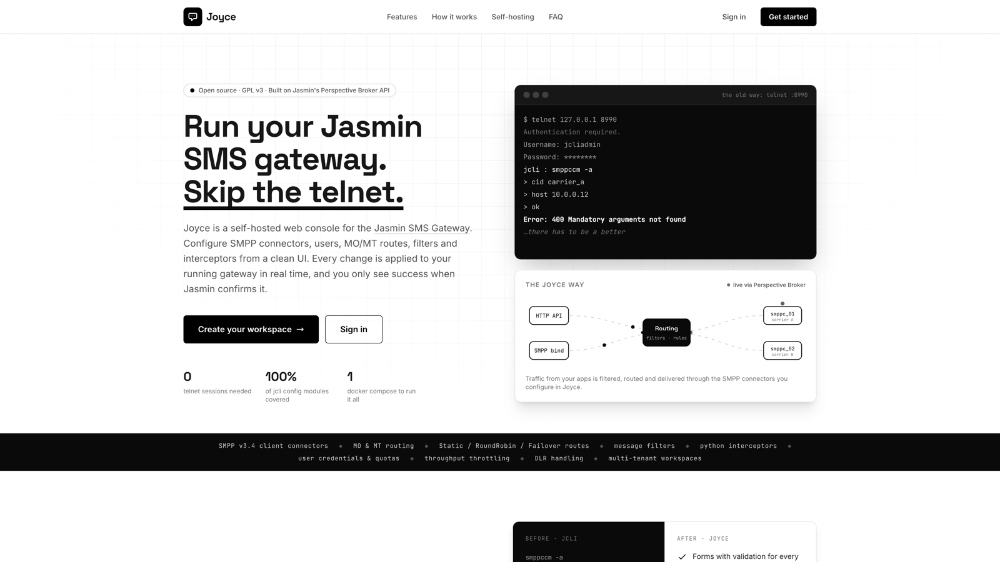
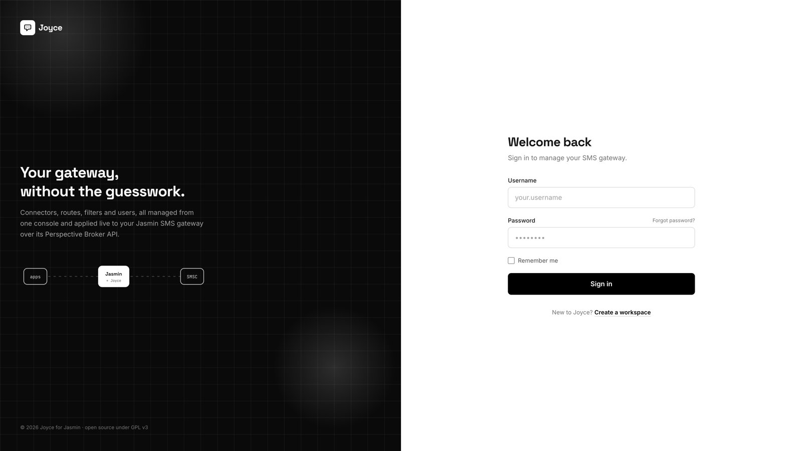
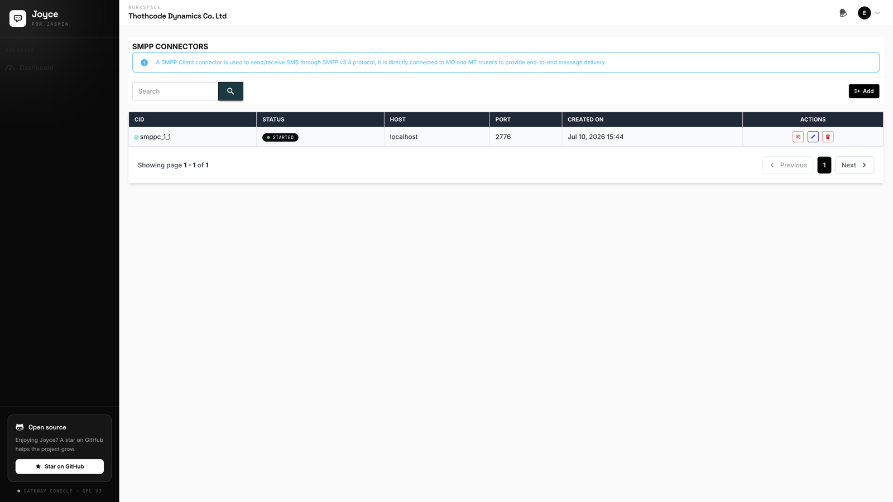
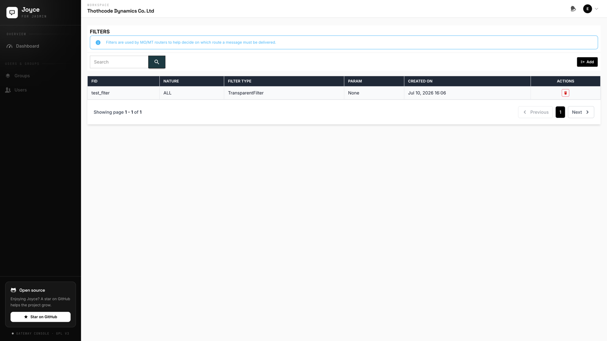
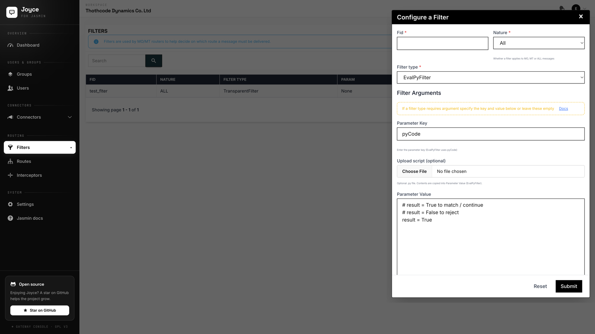
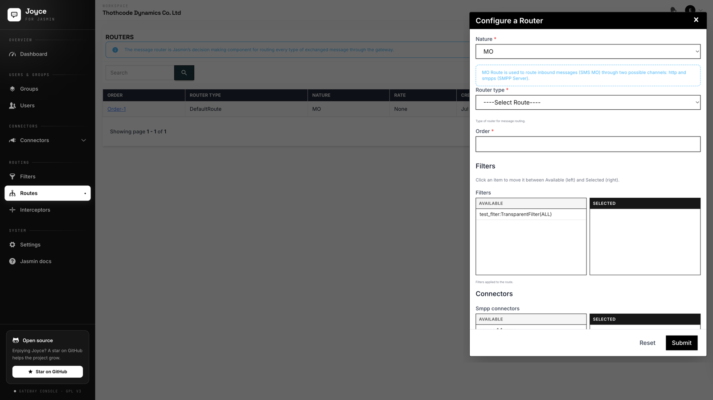
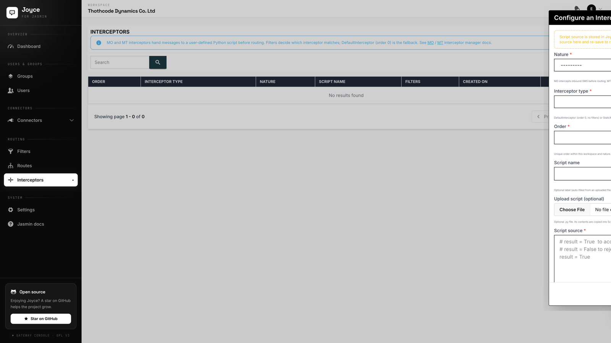
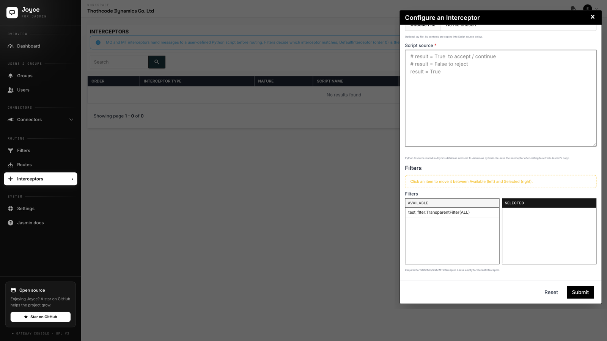
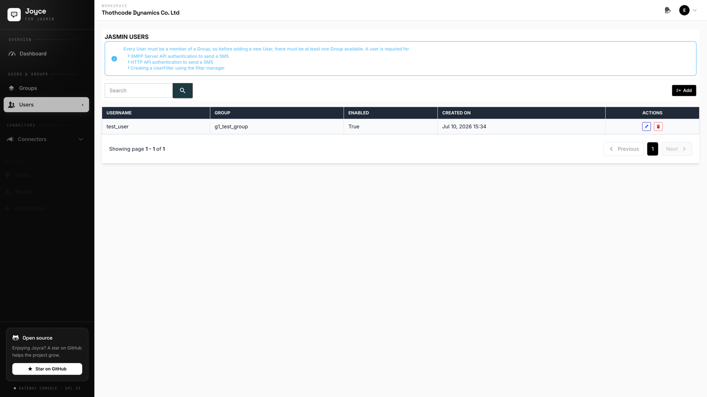

# Joyce: Django GUI for Jasmin SMS Gateway

Tired of fiddling with `jcli`? Joyce is a friendly Django interface that lets you manage Jasmin SMS Gateway using its powerful Perspective Broker API. Send SMS, create groups, add users, and more — all through a clean UI.



---

## Purpose

[Jasmin](https://docs.jasminsms.com/) allows managing SMS routing via CLI (`jcli`) or the more developer-friendly [Perspective Broker API](https://docs.jasminsms.com/en/latest/faq/developers.html). Joyce uses the PB API to offer:

- Group and user management (with credentials, quotas and authorizations)
- SMPP / HTTP connector configuration with live start/stop status
- Filters, MO/MT routes and Python interceptors
- Workspace-based multi-tenant access
- No more `telnet`, no more `jcli` for day-to-day ops

---

## Screenshots

### Sign in



### SMPP connectors

List view with live started/stopped status:



### Filters

Filter list, plus the create form for `EvalPyFilter` (Python source stored in Joyce, optional `.py` upload):





### Routes

Route list and the configure modal. Multi-select fields use a dual list: **Available** on the left, **Selected** on the right (click to move):




### Interceptors

MO/MT interceptors with script source in the database and the same dual-list filter picker:





### Users

Gateway users with messaging authorizations, value filters and quotas:



---

## Integration with Jasmin

This Django application uses the Twisted framework to communicate with the Jasmin RouterPB service.

The integration relies on a custom service layer that uses Twisted’s asynchronous Perspective Broker client to interact with the running Jasmin service. When you save a connector, route or interceptor, Joyce waits for Jasmin to confirm the change and surfaces real errors in the form if something fails.

---

## Setup Guide

This project uses [Poetry](https://python-poetry.org) for dependency management and includes Docker support for consistent local environments.

### Requirements

- Python 3.11+
- Poetry
- Docker (optional but recommended)
- Jasmin SMS Gateway (via Docker or manual installation)

### Step-by-step (Local)

1. Clone the project:

   ```bash
   git clone https://github.com/ekeeya/jasmin-web-gui.git
   cd jasmin-web-gui
   ```

2. Create and activate a virtual environment:

   ```bash
   python3.11 -m venv venv
   source venv/bin/activate
   ```

   Optionally install Poetry in the venv if you do not have it globally:

   ```bash
   pip install poetry
   ```

3. Install dependencies:

   ```bash
   poetry install
   ```

4. Apply migrations:

   ```bash
   python manage.py migrate
   ```

5. Start the server:

   ```bash
   python manage.py runserver
   ```

Open [http://localhost:8000/](http://localhost:8000/) for the landing page, or sign in at `/login/`.

---

## Running Services with Docker

We recommend using Docker for local dev environments. The full Docker setup is defined in `docker-compose.yml`.
In production you may want to add your Django service to `docker-compose.yml`, but in development you may want to run the Django project in an IDE that allows debugging. That is why the Django service is commented out by default.

### What's included

This project is a complete, containerized environment for Jasmin and supporting services:

- A Django web GUI for Jasmin (disabled in Docker by default, as explained above)
- Redis (for caching and Celery results)
- RabbitMQ (as Celery broker)
- Jasmin SMS Gateway
- Jasmin REST API container (served via twistd + WSGI)
- A test SMPP server (`smppsim`) for development

To bring up the services:

```bash
docker compose up --build
```

---

## Contributing

If you find this useful, feel free to fork, improve, and submit pull requests. Bug reports and feature suggestions are always welcome.

---

## Thanks

Thanks to the amazing [Jasmin team](https://www.jasminsms.com/) for building such a powerful and extensible SMS gateway. This project is made possible because of their work.

---

## Buy Me a Coffee on Crypto

If this project helped you avoid hours of pain, consider showing some love (crypto only for now):

**BTC Wallet:** `13it3P99sbMrtobij7S9ecJbE6jTciUw7E`

**ETH Wallet:** `0xA83a39024BEd22ebcE2e64c8D28b541140A9d18d`

Every sip counts and boosts morale!

---

## Contact

Want to get in touch?

- **Email:** ekeeya@ds.co.ug
- **Phone:** +256 765 810-344
- **X:** [@keldoticom](https://x.com/keldoticom)

For business inquiries, feel free to reach out any time.
