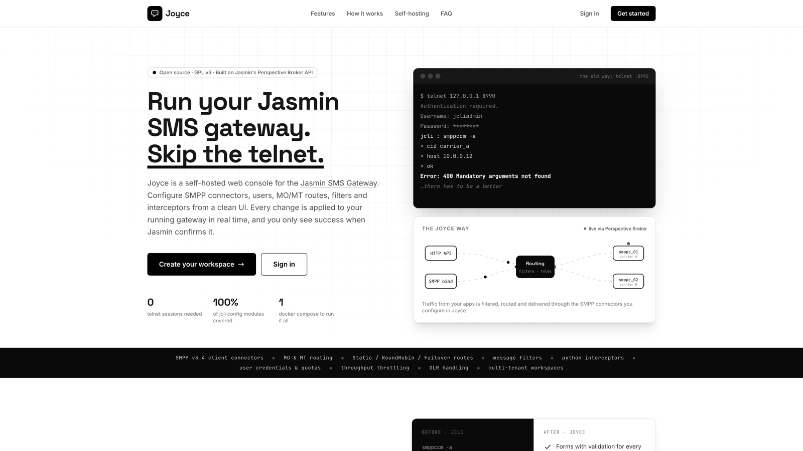
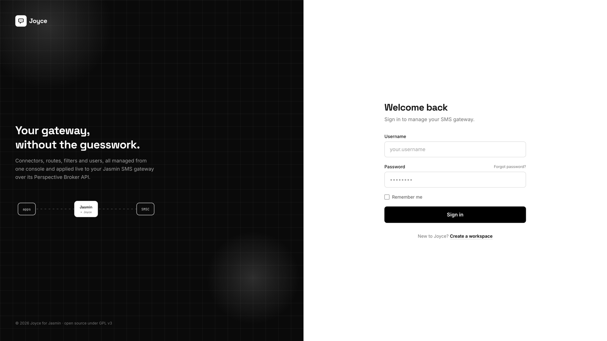
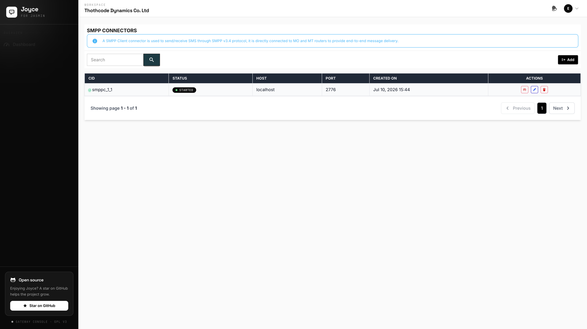
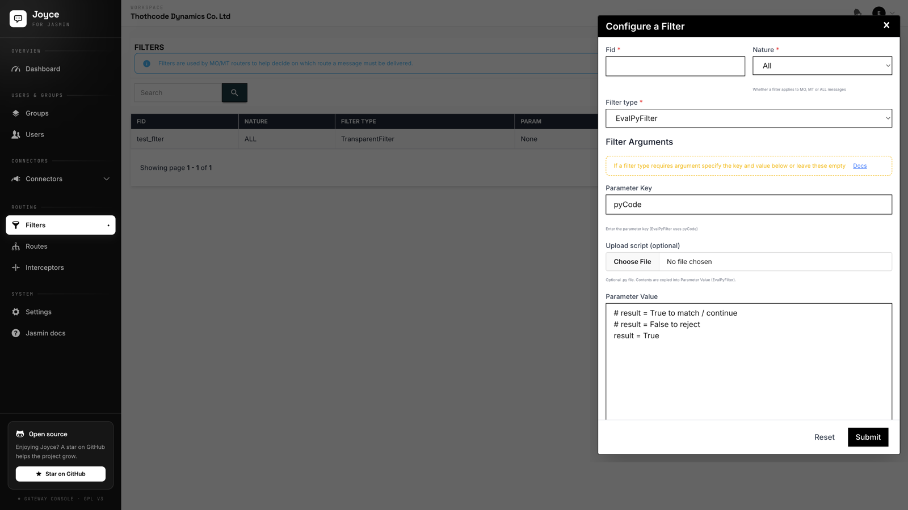
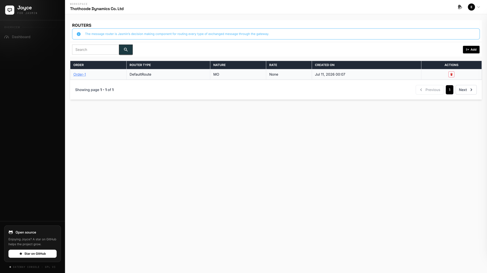
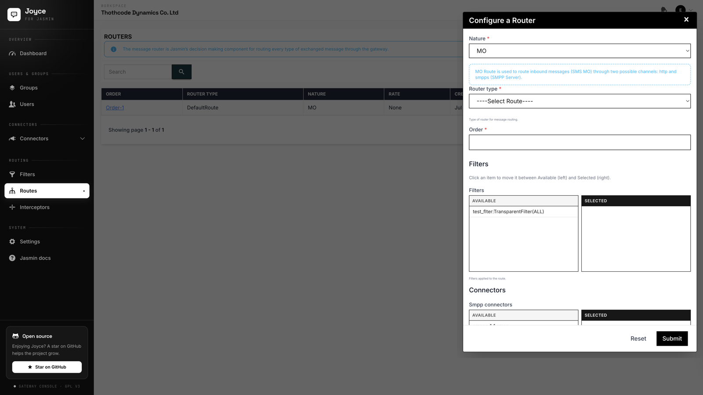
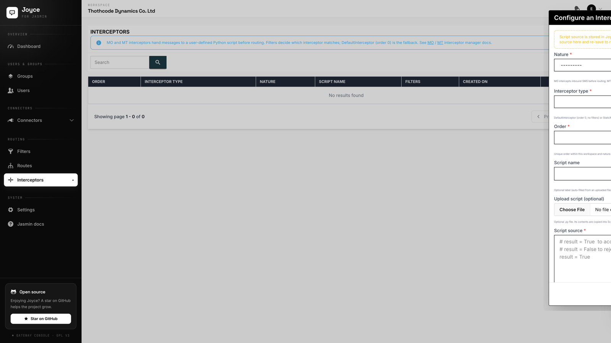
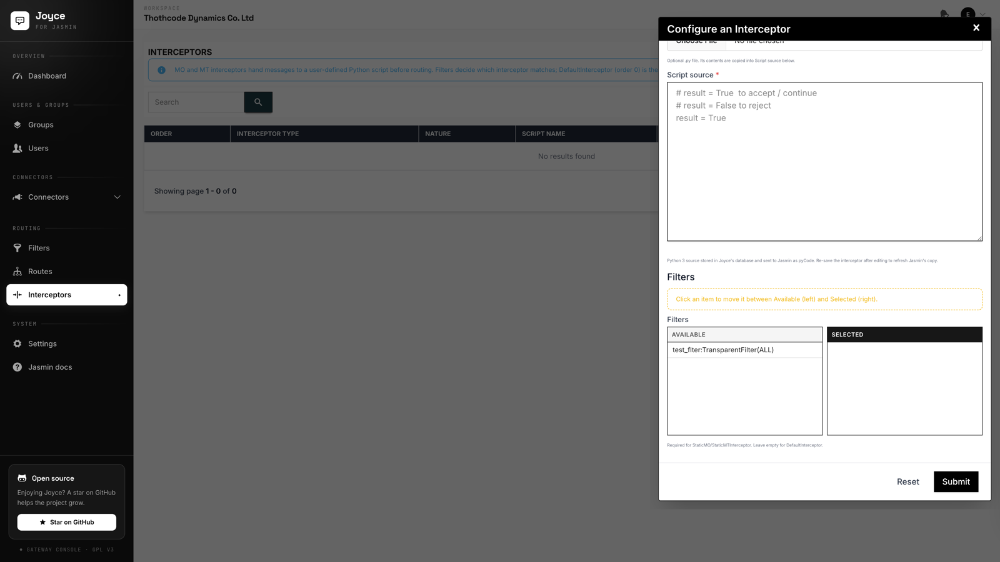
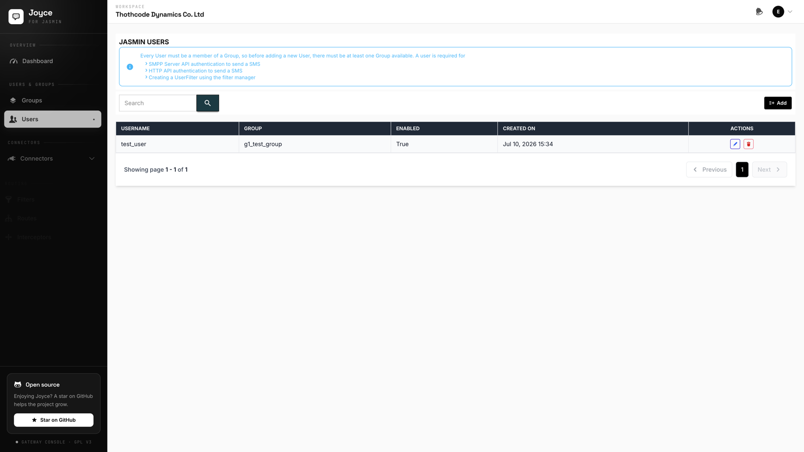

# Joyce: Django GUI for Jasmin SMS Gateway

## Demo (try it now)

**App:** [https://joyce.oddjobs.tech/](https://joyce.oddjobs.tech/)

| | |
|---|---|
| Username | `jdoe` |
| Password | `12345678` |

**New workspace:** [https://joyce.oddjobs.tech/workspace/signup/](https://joyce.oddjobs.tech/workspace/signup/)

**Incoming SMS (MO) tester:** [https://sim.oddjobs.tech/](https://sim.oddjobs.tech/) and specifically [https://sim.oddjobs.tech/inject_mo.htm](https://sim.oddjobs.tech/inject_mo.htm)

The `jdoe` login uses this server's **local demo Jasmin**. Your groups, users, connectors, and routes stay in that workspace. They do not wipe other tenants.

After signup, **Workspace settings** lets you either:

- stay on **Local demo Jasmin** (isolated, prefixed IDs on the shared gateway), or
- choose **My own Jasmin** (Router PB 8988, SMPP CCM PB 8989, HTTP API 1401). Test the connection, then **Import from Jasmin**. Filters come from routes/interceptors; HTTP connectors from MO routes; user passwords cannot be imported.

The MO inject page talks to **this local Jasmin**. With an MO filter and an HTTP connector on your workspace, inbound test messages are forwarded to your callback URL.

---

Tired of fiddling with `jcli`? Joyce is a friendly Django interface that lets you manage Jasmin SMS Gateway using its powerful Perspective Broker API. Send SMS, create groups, add users, and more, all through a clean UI.



## Purpose

[Jasmin](https://docs.jasminsms.com/) allows managing SMS routing via CLI (`jcli`) or the more developer-friendly [Perspective Broker API](https://docs.jasminsms.com/en/latest/faq/developers.html). Joyce uses the PB API to offer:

- Group and user management (with credentials, quotas and authorizations)
- SMPP / HTTP connector configuration with live start/stop status
- Filters, MO/MT routes and Python interceptors
- Workspace-based multi-tenant access
- No more `telnet`, no more `jcli` for day-to-day ops

---

## Screenshots

### Sign in



### SMPP connectors

List view with live started/stopped status:



### Filters

Filter list, plus the create form for `EvalPyFilter` (Python source stored in Joyce, optional `.py` upload):




### Routes

Route list and the configure modal. Multi-select fields use a dual list: **Available** on the left, **Selected** on the right (click to move):





### Interceptors

MO/MT interceptors with script source in the database and the same dual-list filter picker:





### Users

Gateway users with messaging authorizations, value filters and quotas:



---

## Integration with Jasmin

This Django application uses the Twisted framework to communicate with the Jasmin RouterPB service.

The integration relies on a custom service layer that uses Twisted's asynchronous Perspective Broker client to interact with the running Jasmin service. When you save a connector, route or interceptor, Joyce waits for Jasmin to confirm the change and surfaces real errors in the form if something fails.

### Jasmin connection (per workspace)

Every workspace chooses how it reaches Jasmin under **Workspace settings**:

| Choice | Meaning |
|--------|---------|
| **Local demo Jasmin** | Use this Joyce server's `JASMIN_ROUTER_PB_*`, `JASMIN_SMPP_PB_*`, and `JASMIN_HTTP_API_URL` (typical Docker demo). |
| **My own Jasmin** | Store Router PB + SMPP PB + HTTP API endpoints on the workspace. PB passwords are encrypted at rest. |

| Env var | Meaning |
|---------|---------|
| `JOYCE_CREDENTIALS_KEY` | Fernet key for encrypting custom PB passwords. If unset, Joyce persists one in `.joyce_credentials_key`. |

Generate a key:

```bash
python -c "from cryptography.fernet import Fernet; print(Fernet.generate_key().decode())"
```

Until a workspace picks demo or finishes a custom connection, users are redirected to `/workspace/settings/` (also the landing page after signup).

Custom PB passwords are never stored as plain text; Joyce decrypts them only when authenticating to that Jasmin instance.

### External messaging API

Workspaces can enable a token-authenticated send API and optional external DLR forwarding.
See [docs/joyce-messaging-api.md](docs/joyce-messaging-api.md).

---

## Setup Guide

This project uses [Poetry](https://python-poetry.org) for dependency management and includes Docker support for consistent local environments.

### Requirements

- Python 3.11+
- Poetry
- Docker (optional but recommended)
- Jasmin SMS Gateway (via Docker or manual installation)

### Step-by-step (Local)

1. Clone the project:

   ```bash
   git clone https://github.com/ekeeya/jasmin-web-gui.git
   cd jasmin-web-gui
   ```

2. Create and activate a virtual environment:

   ```bash
   python3.11 -m venv venv
   source venv/bin/activate
   ```

   Optionally install Poetry in the venv if you do not have it globally:

   ```bash
   pip install poetry
   ```

3. Install dependencies:

   ```bash
   poetry install
   ```

4. Apply migrations:

   ```bash
   python manage.py migrate
   ```

5. Start the server:

   ```bash
   python manage.py runserver
   ```

Open [http://localhost:8000/](http://localhost:8000/) for the landing page, or sign in at `/login/`.

---

## Running everything with Docker (local)

`docker-compose.yml` starts Joyce, Jasmin, Redis, RabbitMQ, the Jasmin REST API, and our test SMSC (SMPPSim).

```bash
docker compose up --build
```

Joyce is proxied on [http://localhost:8000](http://localhost:8000). Jasmin REST is on `8080`. SMPPSim's web UI is on [http://localhost:88](http://localhost:88).

You can run it two ways:

1. **All in Docker.** Leave the `joyce`, `joyce_celery`, and `joyce_celery_beat` services as they are. Good for a quick full stack.
2. **Django in your IDE.** Comment those three services out (there is a note above `joyce:` in the compose file), start the rest with `docker compose up`, then run `manage.py runserver` and Celery from your IDE. Point the app at the published Jasmin ports on localhost (`8988`, `8989`, `1401`, `8080`). That is the comfortable path when you want breakpoints and a debugger.

Those host ports are only defaults. Change the left-hand side in `docker-compose.yml` (for example `"8088:8080"`) if 8000, 8080, 88, or 2775/2776 are already taken. Inside Docker the service names and container ports stay the same, so Joyce still talks to `jasmin:8988` and `smppsim:2776`.

### About the two test SMSCs

Jasmin already ships a small SMPP server on port **2775**. That is useful for a quick bind, but it is awkward for **MO** (phone to app) testing.

We also ship **SMPPSim**. Use that when you want a proper fake SMSC:

- SMPP bind from Jasmin: host `smppsim`, port **2776**, user `smppclient1`, password `password`
- Web UI (inject an MO): **http://YOUR_HOST:88/** or **http://YOUR_HOST:88/inject_mo.htm**

Do not set the connector host to `localhost` or `jasmin`. From inside Docker, `localhost` is the Jasmin container itself. Always use the compose name `smppsim`.

You do not have to use our test SMSC. If you already have a real SMSC (staging or production), create the connector with **that** host, port, and bind credentials instead, and ignore SMPPSim. You can leave the `smppsim` container stopped (`docker compose stop smppsim`) or skip `sim.example.com` entirely.

---

## Production deploy (Ubuntu + Docker)

This is the path we use on a real server. Docker runs the apps. Nginx on the host terminates HTTPS. Let's Encrypt fills in the certificates.

You will need:

- Ubuntu with Docker Engine and the Compose plugin
- Nginx and Certbot on the host (`sudo apt install nginx certbot python3-certbot-nginx`)
- Postgres reachable from Docker (on the host is fine; use `DB_HOST=host.docker.internal`)
- DNS A records for your subdomains, all pointing at the server IP

### 1. DNS

Pick a domain, for example `example.com`. Create these names:

| Name | What it is |
|------|------------|
| `joyce.example.com` | Joyce UI and Joyce APIs |
| `sms.example.com` | Jasmin HTTP: `/send` on 1401, `/secure/*` on REST 9010 |
| `sim.example.com` | SMPPSim web UI (same thing as host port 88) |

No SMPP hostname. Bind ports are on the server IP:

- **2775**: Jasmin's built-in test SMSC. Open this if you want an ESME to bind to Jasmin.
- **2776**: SMPPSim's SMPP port. Open this if you want an ESME to bind to SMPPSim (same fake SMSC as the web UI on port 88). Joyce/Jasmin in Docker already use `smppsim:2776` without opening this.

Restrict those ports to known IPs if you can. Leave them closed if you do not need external binds.

### 2. Get the code and the env file

```bash
git clone https://github.com/ekeeya/jasmin-web-gui.git
cd jasmin-web-gui
cp .env.prod.example .env.prod
nano .env.prod
```

Set at least:

```env
DB_HOST=host.docker.internal
DB_PORT=5432
DB_NAME=joyce
DB_USER=joyce
DB_PASSWORD=choose-a-strong-password

ALLOWED_HOSTS=joyce.example.com
CSRF_TRUSTED_ORIGINS=https://joyce.example.com

# Jasmin must call Joyce *inside* Docker, not via the public hostname
JOYCE_PUBLIC_BASE_URL=http://joyce:8000
```

If Postgres runs on the Ubuntu host, allow Docker in `pg_hba.conf` (for example `172.16.0.0/12`) and reload Postgres.

### 3. Host nginx (HTTP first)

We do not run nginx in Docker. Copy the sample, put your domain in, then enable the site:

```bash
cp deploy/nginx.conf.example deploy/nginx.conf
nano deploy/nginx.conf   # replace example.com with your domain
sudo cp deploy/nginx.conf /etc/nginx/sites-available/joyce
sudo ln -sf /etc/nginx/sites-available/joyce /etc/nginx/sites-enabled/
sudo nginx -t && sudo systemctl reload nginx
```

`deploy/nginx.conf` is gitignored so your live vhost stays on the server.

### 4. Certificates

```bash
sudo certbot --nginx \
  -d joyce.example.com \
  -d sms.example.com \
  -d sim.example.com
```

Certbot will add HTTPS.

Firewall: open **80** and **443**. Open **2775** if you want clients to bind to Jasmin's test SMSC. Open **2776** if you want clients to bind to SMPPSim. Keep **9003**, **9010**, **1401**, **88**, **8988**, **8989**, and **8990** closed to the world (they are loopback only). From the server you can jcli with `telnet 127.0.0.1 8990`. Port **88** is still how you hit SMPPSim on the box itself (`http://127.0.0.1:88`). Public users should use `https://sim.example.com`.

Feel free to publish the containers on other host ports if these clash with something else on the box. Edit the `"host:container"` mappings in `docker-compose.prod.yml`, then point `deploy/nginx.conf` `proxy_pass` at the new loopback ports. Container-to-container traffic (Joyce to Jasmin, Jasmin to `smppsim:2776`) does not use those host ports, so leave the internal names and ports as they are.

### 5. Build and start with Supervisor

```bash
sudo apt install -y supervisor   # once, if needed
chmod +x deploy/prod.sh deploy/install-supervisor.sh deploy/joyce-compose.sh
./deploy/prod.sh
```

That script:

1. Builds the production images
2. Installs the Supervisor `joyce` program the first time (directory = this checkout)
3. Runs `supervisorctl restart joyce`
4. Reloads host nginx after `nginx -t`

Later deploys are the same command: `./deploy/prod.sh`.

Useful Supervisor commands:

```bash
sudo supervisorctl status joyce
sudo supervisorctl restart joyce
sudo supervisorctl stop joyce
```

To stop the containers, use `sudo supervisorctl stop joyce`. That runs Compose `down` and keeps Supervisor from starting them again until you start/restart. If you run `docker compose ... down` while `joyce` is still RUNNING, Supervisor treats it as a crash and brings the stack back (including published ports).

If you previously used `joyce.service`, `install-supervisor.sh` disables that unit so systemd and Supervisor do not fight over the stack.

### 6. Check it is up

```bash
docker compose -f docker-compose.prod.yml --env-file .env.prod ps
curl -I http://127.0.0.1:9003
curl -I http://127.0.0.1:88
```

Then in a browser:

- https://joyce.example.com
- https://sim.example.com (SMPPSim UI, same as **host:88**)
- On the server: `telnet 127.0.0.1 8990` for jcli

### 7. First login in Joyce

1. Sign up / sign in on `joyce.example.com`.
2. Under workspace settings, pick **Local demo Jasmin** (the Jasmin in this compose file).
3. Create a group and a user.
4. Add an SMPP connector.

   **Option A: our test SMSC (SMPPSim)** if you want to try the stack with no operator yet:

   | Field | Value |
   |-------|--------|
   | Host | `smppsim` |
   | Port | `2776` |
   | Username | `smppclient1` |
   | Password | `password` |
   | Bind | transceiver |

   **Option B: your own SMSC** (staging or production). Use the host, port, system id, and password your provider gave you. You can ignore SMPPSim, stop it with `docker compose -f docker-compose.prod.yml stop smppsim`, and skip the `sim` DNS name.

5. Start the connector. Add an MT route that uses it. Send a test SMS from Joyce.
6. If you are on SMPPSim, test **MO** at https://sim.example.com/inject_mo.htm (or http://YOUR_SERVER:88/inject_mo.htm on the host). If you are on a real SMSC, MO will come from the network the usual way.

DLRs: Jasmin posts to `http://joyce:8000/dlr` inside Docker. Do not set `JOYCE_PUBLIC_BASE_URL` to the public https hostname or receipts will hairpin and often fail.

More detail lives in [docs/ubuntu-deploy.md](docs/ubuntu-deploy.md).

---

## Contributing

If you find this useful, feel free to fork, improve, and submit pull requests. Bug reports and feature suggestions are always welcome.

---

## Thanks

Thanks to the amazing [Jasmin team](https://www.jasminsms.com/) for building such a powerful and extensible SMS gateway. This project is made possible because of their work.

---

## Buy Me a Coffee on Crypto

If this project helped you avoid hours of pain, consider showing some love (crypto only for now):

**BTC Wallet:** `13it3P99sbMrtobij7S9ecJbE6jTciUw7E`

**ETH Wallet:** `0xA83a39024BEd22ebcE2e64c8D28b541140A9d18d`

Every sip counts and boosts morale!

---

## Contact

Want to get in touch?

- **Email:** ekeeya@ds.co.ug
- **Phone:** +256 765 810-344
- **X:** [@keldoticom](https://x.com/keldoticom)

For business inquiries, feel free to reach out any time.
